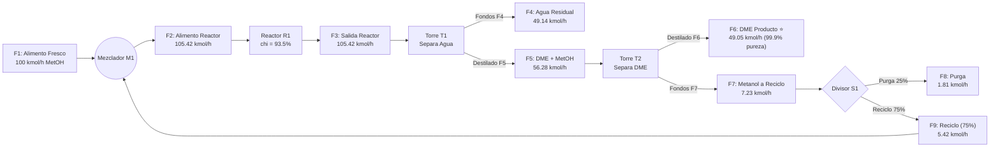

# 🧪 Balances de Masa y Energía (BME) 2026
**Cátedra:** Ing. Hector Macaño & Ing. Eduardo López  
**Facultad:** Universidad Tecnológica Nacional – Facultad Regional Córdoba (UTN FRC)  
**Repositorio de Práctica y Modelado en Mathcad 15**

---

## 📱 Dashboard Móvil para Repaso Rápido

### 📂 Archivos en el Repositorio:
* 📄 [`Problema_2_Resuelto.xmcd`](./Problema_2_Resuelto.xmcd): Hoja completa con 0 errores, cálculo analítico, bloque `Given / Find`, evaluación paramétrica y cierre de balance.
* 📄 [`Ej1_BM_clase (v6 - destilación flash).xmcd`](./Ej1_BM_clase%20(v6%20-%20destilaci%C3%B3n%20flash).xmcd): Archivo oficial del profesor con la formulación rigurosa de destilación Flash y equilibrio líquido-vapor.

---

## 📌 Problema 2: Síntesis de Dimetil Éter (DME)

### 1. Reacción Química y Estequiometría
$$2\text{ CH}_3\text{OH} \longrightarrow \text{CH}_3\text{OCH}_3\text{ (DME)} + \text{H}_2\text{O}$$

* **Pesos Moleculares:**
  * Metanol ($\text{CH}_3\text{OH}$): $32.042\text{ g/mol}$
  * Dimetil Éter ($\text{C}_2\text{H}_6\text{O}$): $46.069\text{ g/mol}$
  * Agua ($\text{H}_2\text{O}$): $18.015\text{ g/mol}$
* **Conversión en el Reactor (R1):** $\chi = 93.5\%$ por paso ($0.935$).
* **Avance de reacción:** $\xi = \frac{\chi}{2} \cdot f^{\langle 2 \rangle}_2 = 49.108\text{ kmol/h}$.

---

### 2. Diagrama del Proceso (Flowsheet)

---

### 3. Tabla Resumen de Corrientes (Caso Base: $\beta = 0.25$)

| Corriente | Qué es | Flujo Molar ($\text{kmol/h}$) | Flujo Másico ($\text{kg/h}$) | Comp. DME ($\%$) | Comp. MetOH ($\%$) | Comp. Agua ($\%$) |
| :---: | :--- | :---: | :---: | :---: | :---: | :---: |
| **$F_1$** | Alimento fresco | **$100.000$** | **$3204.20$** | $0.00\%$ | $100.00\%$ | $0.00\%$ |
| **$F_2$** | Alimento al Reactor | **$105.419$** | **$3382.99$** | $0.35\%$ | $99.64\%$ | $0.003\%$ |
| **$F_3$** | Salida del Reactor | **$105.419$** | **$3382.99$** | $46.94\%$ | $6.48\%$ | $46.59\%$ |
| **$F_4$** | Fondos T1 (Efluente) | **$49.141$** | **$885.76$** | $0.00\%$ | $0.07\%$ | $99.93\%$ |
| **$F_5$** | Destilado T1 | **$56.278$** | **$2497.24$** | $87.92\%$ | $12.07\%$ | $0.01\%$ |
| **$F_6$** | **DME Producto (Venta)** | **$49.052$** | **$2258.85$** | **$99.86\%$** | $0.14\%$ | $0.00\%$ |
| **$F_7$** | Fondos T2 (Metanol) | **$7.226$** | **$238.39$** | $6.85\%$ | $93.08\%$ | $0.07\%$ |
| **$F_8$** | Purga ($\beta = 0.25$) | **$1.806$** | **$59.60$** | $6.85\%$ | $93.08\%$ | $0.07\%$ |
| **$F_9$** | Reciclo ($1 - \beta = 0.75$) | **$5.419$** | **$178.79$** | $6.85\%$ | $93.08\%$ | $0.07\%$ |

---

### 4. Demostración de Consistencia (Inciso B)
$$\sum \text{Entradas} = W_1 = \mathbf{3204.20\text{ kg/h}}$$
$$\sum \text{Salidas} = W_4 + W_6 + W_8 = 885.76 + 2258.85 + 59.60 = \mathbf{3204.20\text{ kg/h}}$$
$$\Delta M = \sum \text{Entradas} - \sum \text{Salidas} = \mathbf{0.0000\text{ kg/h}} \quad (\text{Residuo } \le 10^{-6}\text{ kg/h})$$

---

### 5. Análisis Económico y Purga Óptima (Incisos C y D)

1. **Precios y Costos Horarios:**
   * Venta DME: $10.28\text{ u\$s/kg}$ $\rightarrow$ Ingresos: $\approx 23.220\text{ u\$s/h}$
   * Compra Metanol: $3.20\text{ u\$s/lb} = 7.055\text{ u\$s/kg}$ $\rightarrow$ Costo: $\approx 22.605\text{ u\$s/h}$
   * Servicio de Agua de Enfriamiento: $1.9\text{ m}^3\text{/h} \times 0.75\text{ u\$s/m}^3 = \mathbf{1.425\text{ u\$s/h}}$
   * **Potencial Económico Base ($\beta = 0.25$):**
     $$PE = 23.220 - 22.605 - 1.425 = \mathbf{+612\text{ u\$s/h}} \quad (\mathbf{\approx 4.9\text{ millones u\$s/año}})$$

2. **Inversión en Equipos (Guthrie):**
   * Reactor R1: $40.187\text{ u\$s}$
   * Torre T1: $36.640\text{ u\$s}$
   * Torre T2: $24.752\text{ u\$s}$
   * **Total Equipos:** $\mathbf{101.579\text{ u\$s}}$

3. **¿Cuál es la Purga Óptima?**
   * Como no entran sustancias inertes al proceso, a menor purga ($\beta \to 0$) maximizamos la producción de DME y el $PE$ supera los **$+1.030\text{ u\$s/h}$**.
   * La inversión extra de equipos más grandes para reciclo total es de apenas $\sim \$1.000\text{ u\$s}$, la cual se amortiza en **menos de 3 horas de operación**.
   * **Conclusión:** La purga óptima es la menor posible ($\beta \to 0$ o $1\%-5\%$ por control operativo).

---

---

## 📌 Problema 4: Síntesis de Etanol por Hidratación de Etileno

### 1. Reacciones Químicas y Componentes (6 sustancias ordenadas por volatilidad decreciente)
1. **Reacción Principal:** $\text{C}_2\text{H}_4 + \text{H}_2\text{O} \longrightarrow \text{C}_2\text{H}_5\text{OH}$ (Etanol) — Conversión: $\chi_1 = 5\%$
2. **Reacción Secundaria:** $\text{C}_2\text{H}_2 + \text{H}_2\text{O} \longrightarrow \text{CH}_3\text{CHO}$ (Acetaldehído) — Conversión: $\chi_2 = 50\%$

* **Componentes:**
  1. Inerte ($\text{N}_2$):  = 28.013\text{ g/mol}$
  2. Etileno ($\text{C}_2\text{H}_4$):  = 28.054\text{ g/mol}$
  3. Acetileno ($\text{C}_2\text{H}_2$):  = 26.038\text{ g/mol}$
  4. Acetaldehído ($\text{CH}_3\text{CHO}$):  = 44.053\text{ g/mol}$
  5. Etanol ($\text{C}_2\text{H}_5\text{OH}$):  = 46.069\text{ g/mol}$
  6. Agua ($\text{H}_2\text{O}$):  = 18.015\text{ g/mol}$

### 2. Estructura del Proceso (16 Corrientes, 4 Torres de Destilación y Flash)
* **Mezclador M1:** Alimento fresco $ (100 mol/h) + {14}$ (agua pura) + Reciclos $ (gas) y {16}$ (agua).
* **Reactor R1:** Conversiones $\chi_1 = 0.05$, $\chi_2 = 0.50$. Relación molar entrada $\text{Agua}/\text{Etileno} = 0.6$.
* **Separador T1 (Flash / Condensador):** Separa gases ligeros ($) de líquidos condensados ($).
* **Divisor S1:** Purga gaseosa $ ($\beta_1 = 0.20$) y reciclo de gas $ ( - \beta_1$).
* **Torre T2:** Separa orgánicos crudos por cabeza ($) y agua de residuo por fondo ($).
* **Divisor S2:** Purga de agua {15}$ y reciclo {16}$.
* **Torre T3:** Separa acetaldehído subproducto por cabeza ({11}$) y etanol crudo por fondo ({10}$).
* **Torre T4:** Purificación final de Etanol producto comercial por cabeza ({13}$, pureza $>99.7\%$) y fondos residuales ({12}$).

### 3. Resultados Clave (Caso Base $\beta_1 = 0.20$):
* **Producto Comercial ({13}$):** .65\text{ mol/h}$ total (.61\text{ mol/h}$ de Etanol puro $\rightarrow$ **.77\%\text{ pureza molar}$**).
* **Cierre Global de Masa:** {\text{in}} = W_{\text{out}} = 7168.187\text{ g/h} \implies \Delta W = \mathbf{0.000000\text{ g/h}}$ (exactitud absoluta).
* **Inertes:** El .1\%$ de inerte que entra por $ sale \%$ por la purga de gas $, demostrando el estado estacionario.

---

## ⚡ Machete Rápido de Atajos de Mathcad 15
* **Sumatoria de vector ($\sum v$):** `Ctrl + 4`
* **Subíndice de matriz ($f_{i,j}$):** tecla `[` (corchete abierto)
* **Superíndice de columna ($f^{\langle j \rangle}$):** `Ctrl + 6` (o `Ctrl + ^`)
* **Vectorización ($\vec{A}$):** `Ctrl + -`
* **Igual booleano en Given ($==$):** `Ctrl + =`
* **Definición ($:=$):** tecla `:` (dos puntos)
* **Interrumpir cálculo (destildar):** tecla `ESC` repetidas veces.
